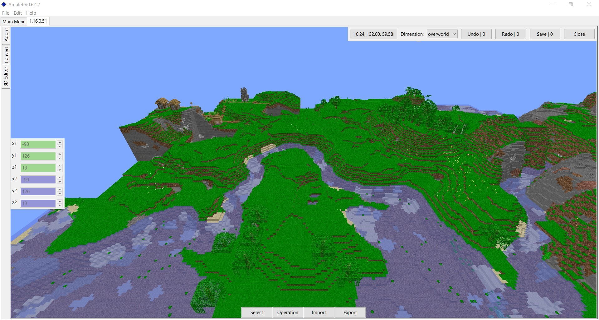

# Amulet Map Editor

A new Minecraft world editor and converter that supports all versions since Java 1.12 and Bedrock 1.7.

## Running compiled builds

Download the zip file for your operating system from the list of [compiled builds](https://github.com/Amulet-Team/Amulet-Map-Editor/releases). (Currently Windows only)

Extract the contained folder to a location on your computer and run the executable.

## Running from Source

**If you are running a compiled build you do NOT need to do this.**

1) Install [Python 3.9+](https://www.python.org/)
2) We recommend setting up a [python virtual environment](https://docs.python.org/3/tutorial/venv.html) so you don't run into issues with dependency conflicts.
3) run `python -m pip install amulet-map-editor` to install the library and all its dependencies.
4) run `python -m amulet_map_editor` to run the program

### Notes

If you have python 2 installed `python` may point to the wrong version in which case you will have to swap out `python` for `python3`

When installing from source the following dependencies will be installed

- numpy
- wxpython
- pyopengl
- [Amulet-Core](https://github.com/Amulet-Team/Amulet-Core)  The library to handle loading and saving data to the world formats.
- [Amulet-NBT](https://github.com/Amulet-Team/Amulet-NBT)  The library to handle reading and saving NBT and SNBT.
- [PyMCTranslate](https://github.com/gentlegiantJGC/PyMCTranslate)  The library to handle block, block entity, entity and biome translation. between versions
- [Minecraft-Model-Reader](https://github.com/gentlegiantJGC/Minecraft-Model-Reader)  The library to handle loading block models and textures from a resource pack for use in the renderer.

## Contributing

For information about contributing to this project, please read the [contribution](contributing.md) file.
