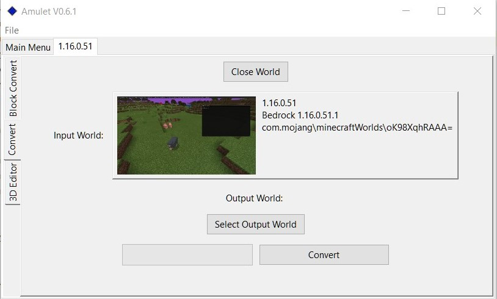

# Convert Program

## About
The conversion program takes the world you currently have opened (the source world), in whatever format the world is in, and converts that data to the format of the destination world that you select. It then merges that data with the destination world that you select.

This means that any chunks that exist in the source world will be overwritten in the destination world. It is advised to backup both worlds before starting the conversion process in case something goes wrong. In theory only the destination world should be modified.

If there is a chunk in the destination world and there is no chunk in the source world at that location then the chunk will be left as it was.

## How to use

- Make sure that any world you wish to open is not open in game or another program.
- Backup both the world you want to convert from and the world you want to convert to in case there are any corruptions.
- [Open your source world](../../readme.md#open-world). This should bring up a screen which looks similar to the image above with "convert" on the left.
- Click on the convert tab on the left if it is not enabled. This should make the screen look the same as the image above with the world imformation populated with your source world information.
- Click the select output world button and select the destination world in a similar way to how you selected the source world.
- Check that the worlds shown are the world you want to convert from and the world that you want to convert into.
- Press the convert button and wait for the loading bar to fill up. This may take a while if your source world is large.
- Once finished click the "Close World" button at the top to close the worlds before opening them in game.
