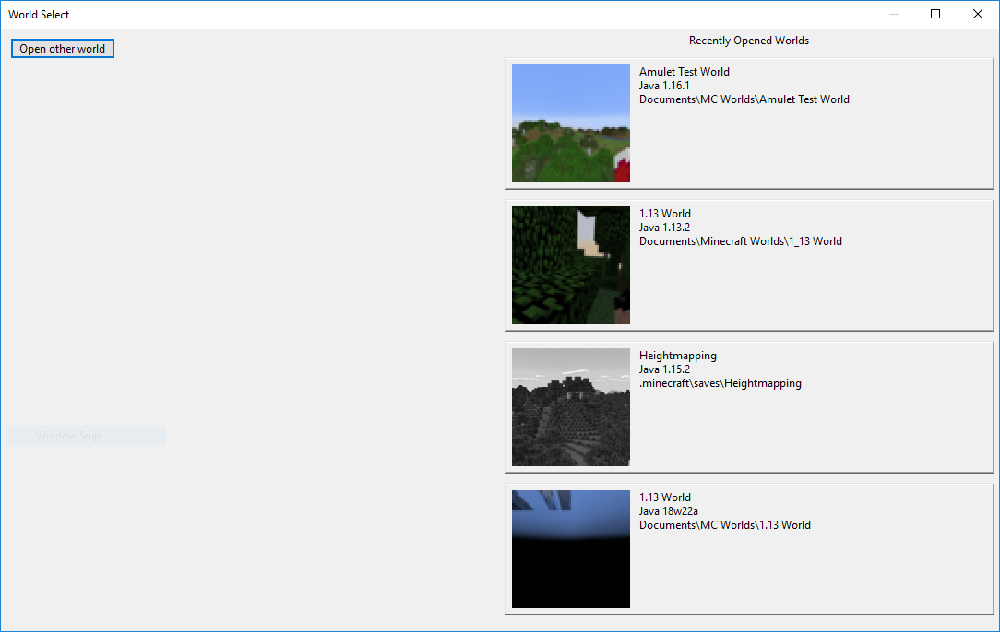
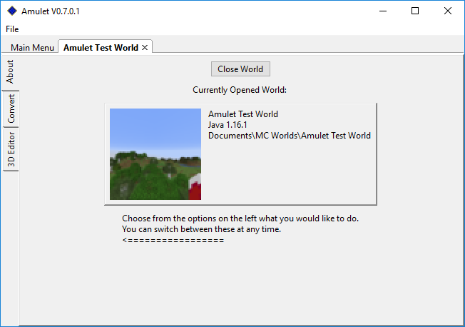

Getting Started
===============

.. _installing-amulet-ref:

Installing Amulet
-----------------

For the purpose of this tutorial only instructions for installing Amulet
from our pre-built/compiled builds will described, for instructions to install
from our source code please refer to our `README`_.

You can always find our latest release on our `Github Releases`_ page. The latest
release will always beat the top of this page. From there, there should a section
labeled `Assets`, which should look like the following:

.. figure:: _static/images/installation_assets.png
    :scale: 75 %
    :align: center

    The `Assets` section for release v0.7.0.1

From there, download the appropriate .zip file for your operating system.
After the download has completed, make sure to extract the files out of the .zip
file into a directory. Once finished, run the appropriate executable for your operating system:

* Windows: ``amulet_app.exe``
* OSX: ``amulet_app.app``
* Linux: *TODO*

.. _opening-a-world-ref:

Opening a World
---------------

:emphasis:`Note: We recommend that any world that is to be opened by Amulet is backed up to
avoid any loss of data`

When starting Amulet, you should be presented with a screen similar to
the following:

.. figure:: _static/images/start_screen.png
    :scale: 75 %
    :align: center

    The start screen of Amulet

After clicking the ``Open World`` button, you will be presented with the following pop-up dialog:

    The world select pop-up dialog

The worlds on the right side of the dialog will be worlds that have previously been opened by Amulet
and clicking the ``Open other world`` button will show a directory choosing dialog. Using this dialog,
select the world directory that you wish to open and then select ``Select folder``

Once the world has successfully been loaded by Amulet, the following be be displayed:

    The world screen

From this screen, a summary of information about the world is displayed such as the world name, the
last version and platform of Minecraft the world was opened in, and the ending of the file path where
the world is located.

On the left side there are 3 tabs, with the current being the ``About`` tab, where various sub-programs
of Amulet can be accessed and used.

As of v0.7.0.1, these tabs are:

* ``About`` - Summary of the opened world's information
* ``Convert`` - The Amulet world converter, see the :doc:`/world_converter`
* ``3D Editor`` - The Amulet 3D editor, see the :doc:`/world_editor`

.. _README: https://github.com/Amulet-Team/Amulet-Map-Editor#running-from-source
.. _Github Releases: https://github.com/Amulet-Team/Amulet-Map-Editor/releases