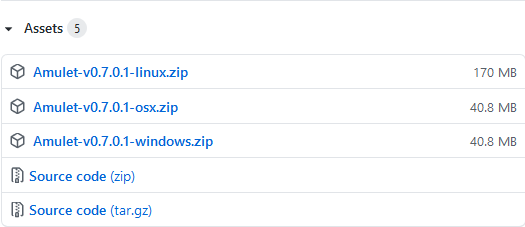
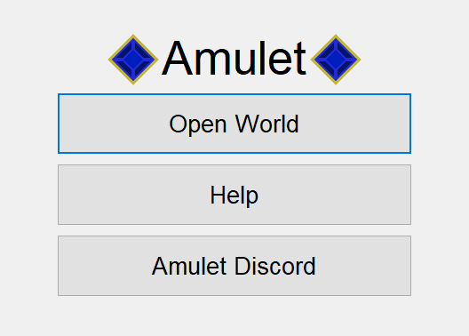

Getting Started
===============

Installing Amulet
-----------------

For the purpose of this tutorial only instructions for installing Amulet
from our pre-built/compiled builds will described, for instructions to install
from our source code please refer to our `README`_.

You can always find our latest release on our `Github Releases`_ page. The latest
release will always beat the top of this page. From there, there should a section
labeled `Assets`, which should look like the following:

    The `Assets` section for release v0.7.0.1

From there, download the appropriate .zip file for your operating system.
After the download has completed, make sure to extract the files out of the .zip
file into a directory. Once finished, run the appropriate executable for your operating system:

* Windows: ``amulet_app.exe``
* OSX: ``amulet_app.app``
* Linux: *TODO*

Opening a World
---------------

When starting Amulet, you should be presented with a screen similar to
the following:

    The start screen of Amulet

.. _README: https://github.com/Amulet-Team/Amulet-Map-Editor#running-from-source
.. _Github Releases: https://github.com/Amulet-Team/Amulet-Map-Editor/releases