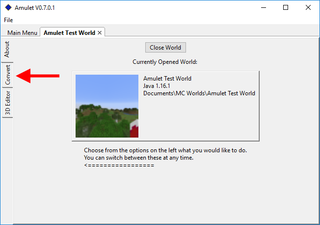
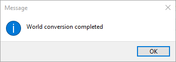

World Converter Tutorial
========================

Things you will need:

* Amulet
* The world you want to convert (referred to as ``source world``)
* A world from the same Minecraft platform and version you want the world to be converted to (referred to as ``destination world``)

1. Load the ``source world`` into Amulet
2. Once the world has been loaded, launch the ``Convert`` sub-program

    The ``Convert`` sub-program can be found on the left side of the world screen

3. Click the ``Select Output World`` button and follow the same world loading process and select your desired ``destination world``
4. Once the ``destination world`` has been loaded, click the ``Convert`` button
5. The progress bar should update with the progress of the conversion and the following dialog should pop-up once it reaches the end:

6. Once the conversion finishes, you can close Amulet and open the ``destination world`` in the desired/target Minecraft version/platform

